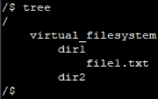
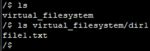
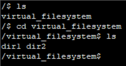
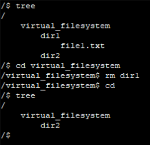

# ShellEmulator
Первое домашнее задание по Конфигурационному Управлению

## Постановка задачи

### Задание №1
Разработать эмулятор для языка оболочки ОС. Необходимо сделать работу
эмулятора как можно более похожей на сеанс shell в UNIX-подобной ОС.
Эмулятор должен запускаться из реальной командной строки, а файл с
виртуальной файловой системой не нужно распаковывать у пользователя.
Эмулятор принимает образ виртуальной файловой системы в виде файла формата
tar. Эмулятор должен работать в режиме GUI.
Конфигурационный файл имеет формат xml и содержит:
- Путь к архиву виртуальной файловой системы.
- Путь к стартовому скрипту.

Стартовый скрипт служит для начального выполнения заданного списка
команд из файла.
Необходимо поддержать в эмуляторе команды ls, cd и exit, а также
следующие команды: rm, tree.
Все функции эмулятора должны быть покрыты тестами, а для каждой из
поддерживаемых команд необходимо написать 3 теста.

Для запуска ввести в консоль: 

```python emulator.py config.xml```

Для запуска тестов ввести в консоль: 

```python -m unittest test_shell_emulator.py```

### Важно!

Для работы программы необходимо поменть путь к директории проекта в файле config.xml

## Описание алгоритма

1. Классы для представления файловой системы:

- FileSystemEntry: базовый класс для всех элементов файловой системы. Хранит имя и ссылку на родительский элемент.
- File: наследуется от FileSystemEntry, представляет файл. Хранит данные файла.
- Directory: наследуется от FileSystemEntry, представляет директорию. Хранит дочерние элементы (файлы и поддиректории).

2. Чтение конфигурационного файла:

- Функция read_config: принимает путь к конфигурационному файлу XML, читает его и извлекает путь к файловой системе (tar) и путь к стартовому скрипту.

3. Построение файловой системы:

- Функция build_filesystem: принимает путь к tar-архиву, открывает его и создает иерархию директорий и файлов, читая содержимое архива и организуя его в структуру Directory и File.

4. Сохранение файловой системы:

- Функция save_filesystem: сохраняет текущую структуру файловой системы в tar-архив, перебирать элементы в структуре и добавляет их в архив.

5. Класс ShellGUI:

Основной класс, отвечающий за интерфейс приложения и логику командной оболочки.
Включает методы для обработки пользовательского ввода (нажатий клавиш, выполнения команд и т.д.).

Поддерживает команды:
- ls: отображает содержимое текущей директории.
- cd: изменение текущей директории.
- rm: удаление файла или директории.
- tree: отображает дерево файлов и директорий.
Реализует методы, обеспечивающие работу с путями и обновление промпта (например, update_prompt, resolve_path, get_cwd_path).

6. Запуск программы:

Вызов выполняется в if __name__ == '__main__', который проверяет наличие аргумента командной строки (путь к конфигурационному файлу). Если аргумент отсутствует, программа выводит инструкцию по использованию.

### Как работает программа

При запуске программа ожидает аргумент командной строки с путем к конфигурационному файлу.  
Читает конфигурацию, получая пути к tar-архиву и стартовому скрипту.  
Загружает файловую систему из архива, создавая виртуальную структуру директорий и файлов.  
Инициализирует GUI с помощью Tkinter, предоставляя поле для ввода команд.  
Пользователь может вводить команды, взаимодействовать с файловой системой и просматривать данные.  
Команды, такие как переключение директорий и удаление файлов, изменяют виртуальную файловую систему. При удалении файла вызывается функция сохранения, чтобы обновить tar-архив.

## Тестирование программы

1. Тестирование команды tree:



2. Тестирование команды ls:



3. Тестирование команды cd:



4. Тестирование команды rm:



